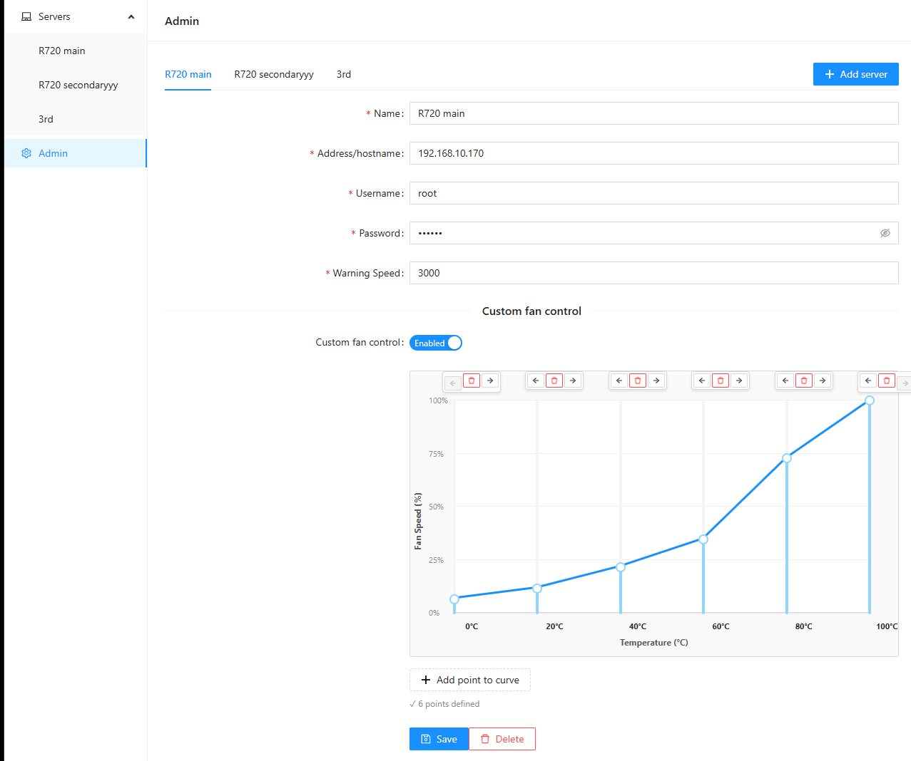

# Dell Server Monitor

A react web app for monitoring dell servers over IPMI

## Known working hardware

* R720 with iDRAC7 - Monitoring + fan control
* R620 [#25](/../../issues/25)
* R710 with iDRAC6 [#3](/../../issues/3)
* R730XD idrac 8 Enterprise [#87](/../../issues/87)
* R520 [#77](/../../issues/77)
* T430 [#90](/../../issues/90)

If you have it running on different hardware or have ipmi commands for setting fanspeeds on different hardware, please submit a PR or open an issue.

## Setup

The app is designed to run with docker compose, see the compose.yml file in this repo for a sample deployment. No extra configuration except for changing the exposed port should be needed. Be aware that this project doesn't currently support any form of authentication, so shouldn't be exposed to the internet.

Run with prebuilt image:

```
    git clone https://github.com/Danielv123/serverManager
    cd serverManager
    docker compose up -d
```

Build it yourself:

    git clone https://github.com/Danielv123/serverManager
    cd serverManager
    docker compose -f compose-dev.yml up -d --build

Finally, navigate to localhost:8083

Server overview:


Admin interface with idrac ipmi connection details and a custom fan curve:


